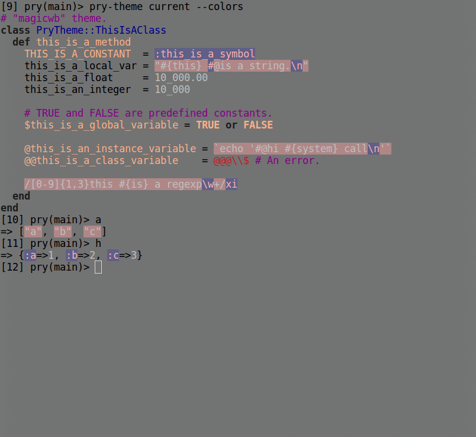

MagicWB (Amiga) for Pry 
======================= 

This theme translates into Pry the MagicWB (Amiga) theme as found in Text Mate & Sublime Text. 

I love this theme because strings leap out from the other text. Symbols also become a lovely purple color. 

| Attribute              | Value
|:-----------------------|:----------------------
| Font                   | Monospace 
| Font size              | 10 by default, but scaled up in the screenshot 
| Foreground color (HEX) | #000000
| Background color (HEX) | #888888 
