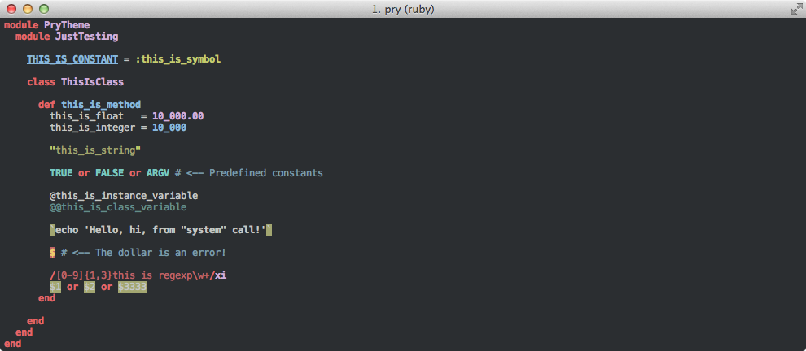

A port of [TomorrowNight](https://github.com/chriskempson/tomorrow-theme) by Chris Kempson.

This theme doesn't make use of true 256 colors, because they don't let you specify your own color values, so I recommend you install one of the TomorrowNight terminal themes.

# Screenshot Info

| Attribute              | Value
|:-----------------------|:---------------
| Font                   | Menlo regular
| Font Size              | 12
| Foreground Color (HEX) | #b7bbb7
| Background Color (HEX) | #1d1f21
