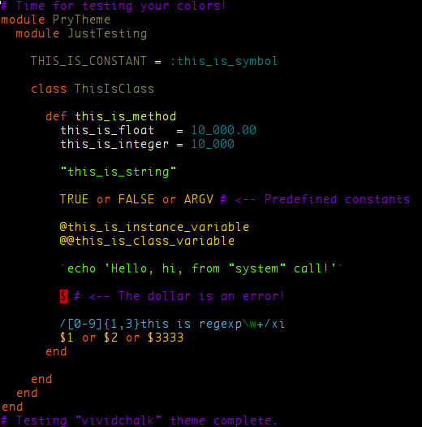

Vividchalk for Pry
==================

Screenshot information:

| Attribute              | Value
|:-----------------------|:----------------------
| Font                   | Monaco
| Font size              | 10
| Foreground color (HEX) | #EEEEEE
| Background color (HEX) | #000000
